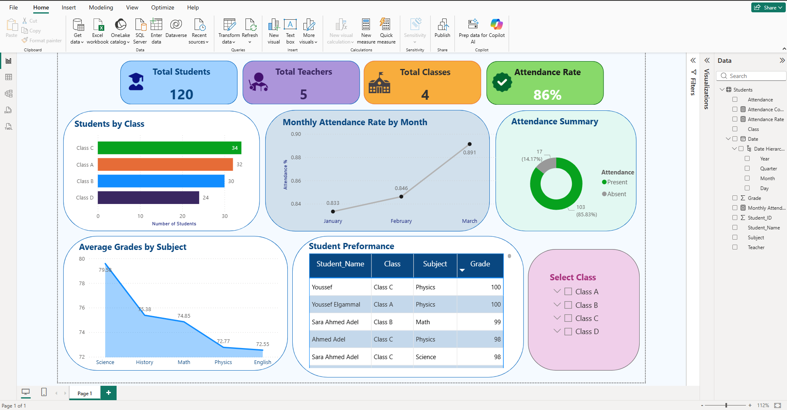
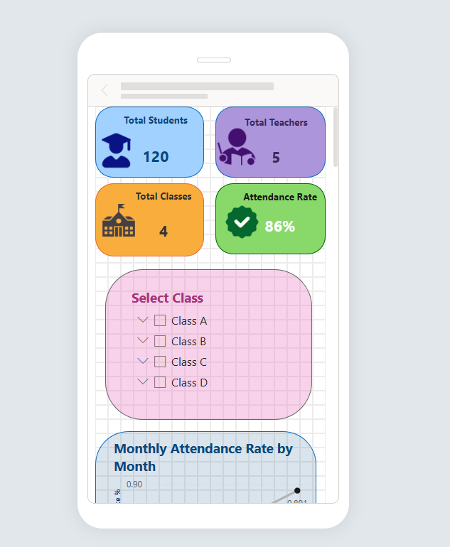
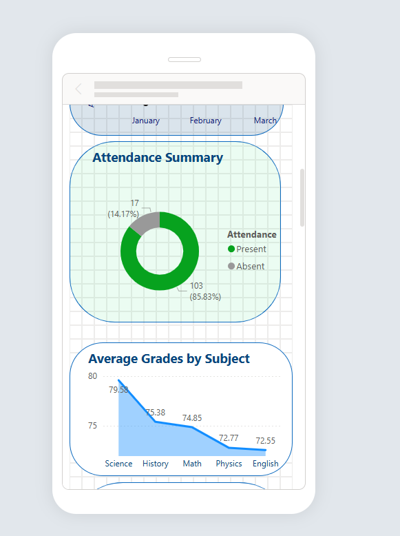

# School Admin Dashboard

**School Admin Dashboard** هو مشروع متكامل لإدارة بيانات المدرسة وتحليلها باستخدام **Power BI**.  
الهدف من المشروع هو تسهيل متابعة الطلاب، المدرسين، الحضور، الدرجات، والفصول بشكل **مرئي واحترافي**.

---

## Project Overview

يحتوي الـ Dashboard على **4 Cards رئيسية** تعرض أهم إحصائيات المدرسة:  

1. **عدد الطلاب**  
2. **عدد المدرسين**  
3. **عدد الفصول**  
4. **نسبة الغياب**

كما يوفر **تحليلات متقدمة** تشمل:  

- **Students by Class**: توزيع الطلاب حسب الفصول  
- **Monthly Attendance Trend**: متابعة الحضور شهريًا  
- **Attendance Summary**: ملخص حضور الطلاب  
- **Average Grades by Subject**: تحليل متوسط درجات الطلاب لكل مادة  
- **Student Performance**: ترتيب الطلاب من حيث الأداء الأكاديمي  
- **Dynamic Filters**: اختيار Class، Subject، أو Teacher لتصفية البيانات حسب الحاجة  

---

## Features

- عرض **Top Performing Students** حسب درجاتهم  
- تتبع **الحضور والغياب** لكل طالب  
- تحليل **الدرجات حسب المادة والفصل**  
- عرض **إحصائيات المدرسة والإدارة**  
- **Interactive Slicers** لاختيار Class, Subject, أو Teacher  
- **Dynamic Top N**: إمكانية عرض أفضل 5 أو 10 طلاب حسب الأداء  

---

## Files in Repository

- `School_Admin_Dashboard_1.pbix` : ملف Power BI الرئيسي للـ Dashboard  
- `school_data.xlsx` : بيانات الطلاب، حضورهم، ودرجاتهم  
- `Demo/` : صور توضيحية للـ Dashboard  

---

## Dashboard Preview

**Overview Cards:**  

**Monthly Attendance Trend:**  

**Student Performance Table:**  

> ضع أي صور إضافية في فولدر `Demo/` واستخدم نفس الأسلوب لعرضها هنا.

---

## How to Use

1. افتح **School_Admin_Dashboard_1.pbix** في Power BI Desktop  
2. تأكد من استيراد البيانات من `school_data.xlsx`  
3. استخدم الـ **Slicers** لاختيار الفصول، المواد، أو المدرسين  
4. شاهد الـ **Cards والـ Visuals** تتحدث تلقائيًا حسب اختياراتك  

---

## Notes

- كل البيانات الموجودة هي بيانات نموذجية لتوضيح وظيفة الـ Dashboard  
- يمكن تعديل البيانات بسهولة أو إضافة أعمدة جديدة لدعم تحليلات إضافية  
- يمكن إضافة Visuals جديدة حسب احتياجات المدرسة أو الإدارة  

---

## License

المشروع **مفتوح المصدر** ويمكن استخدامه أو تعديله لأي أغراض تعليمية أو تجريبية.